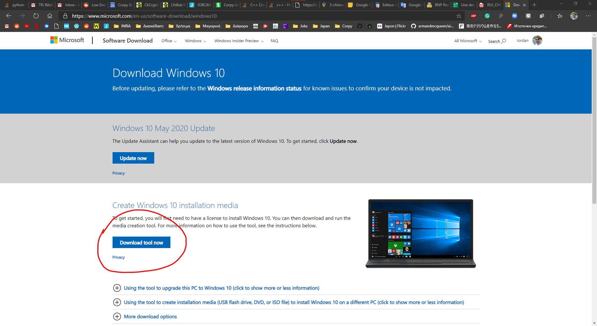
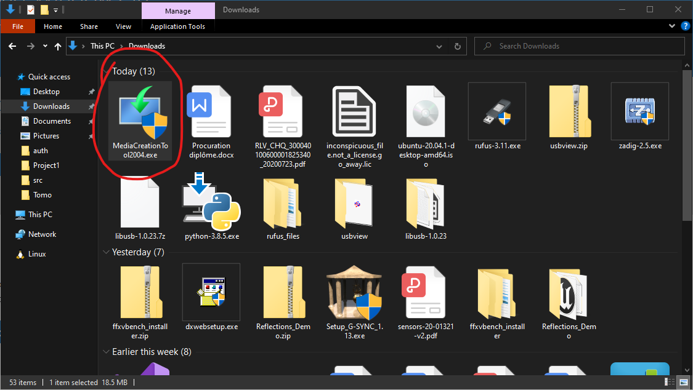
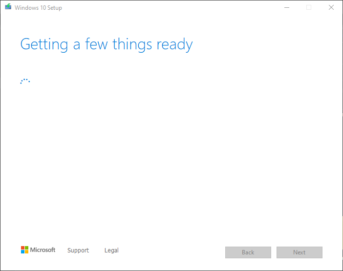
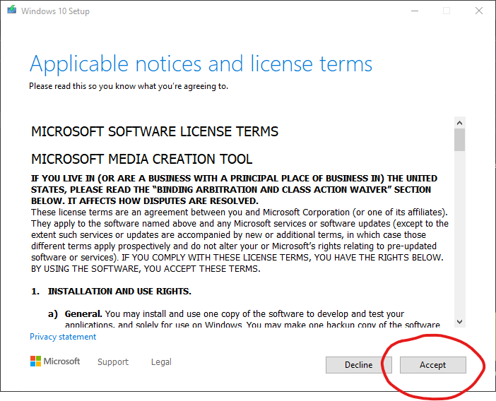
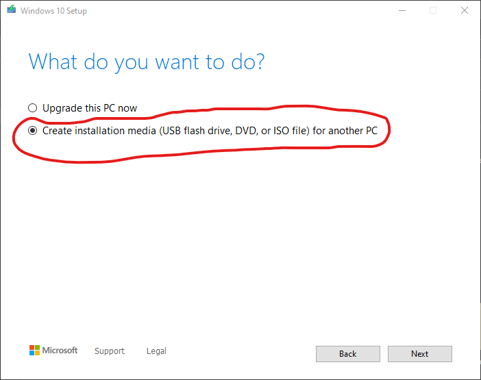
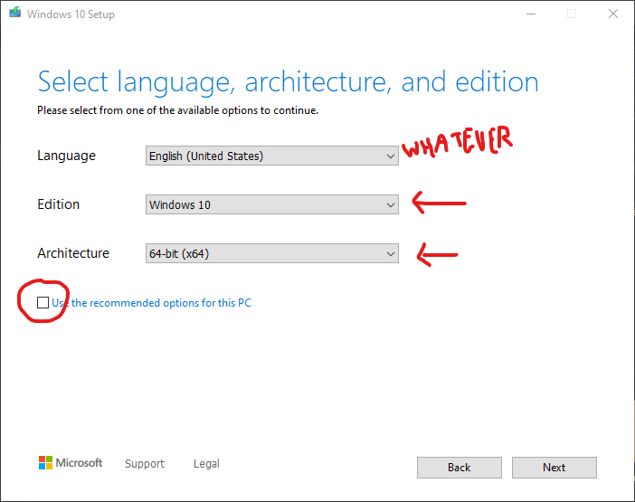
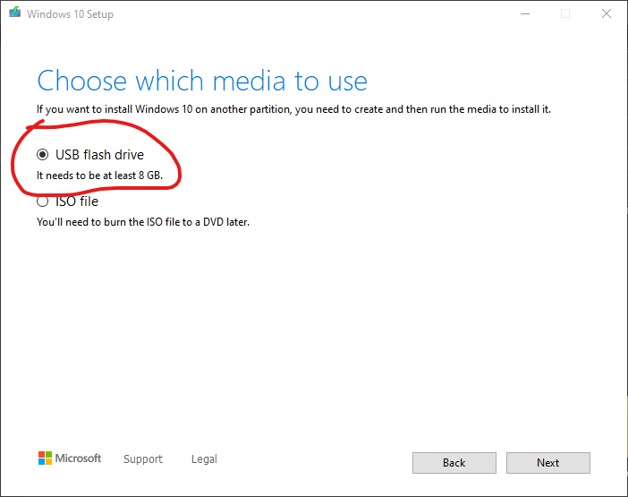
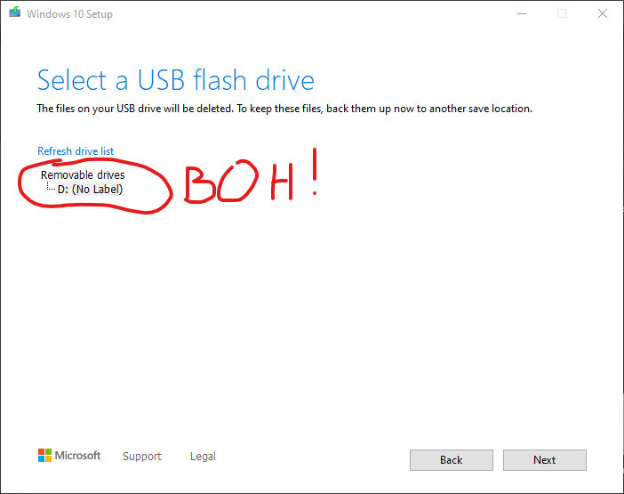
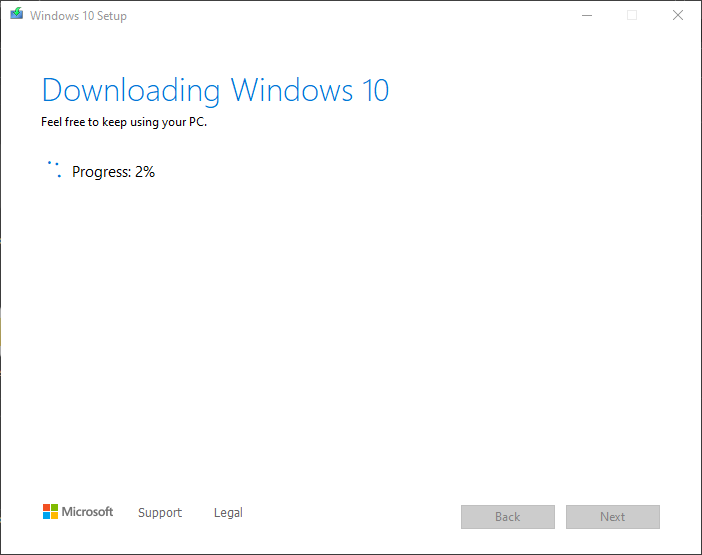
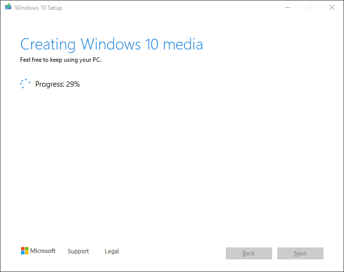

# Come riparare il tuo computer, Kiki

Prima di tutto, ti serve una chiavetta USB da 8GB minimo. Se hai una più grande, va bene lo stesso. Se devi comprare una nuova, 8GB bastano.

Appena hai la chiavetta USB, trovi un computer con connessione ad Internet. Nota che si devono scaricare tutti i file di Windows, quindi serve una connessione abbastanza buona.

Prima cosa, ti devi connettere su questo sito: https://www.microsoft.com/en-us/software-download/windows10

Poi, devi premere questo pulsante:

Si scaricherà un file bellissimo che sarebbe una cosa del genere:

Inserisci la chiavetta USB nel computer ed esegui quindi questo file bellissimo. Devi un po' attendere: 

Appena lui ha fatto tutto quello che deve fare, ti chiederà di accettare le condizioni d'uso. Accetta pure, la vita è troppo breve per leggere le condizioni d'uso di Windows.

Dopo lui continua a chiederti che vuoi fare. Digli che vuoi creare una chiavetta USB.

In questa schermata, devi fare un po' attenzione. Assicurati che la scelta in basso non è selezionata, così potrai cambiare delle cose. Seleziona "Windows 10" e "64-bit", come mostrato sull'immagine. Per la lingua, metti pure quello che vuoi, ma forse è meglio se ci metti l'Italiano, visto che è la lingua attuale del tuo laptop.

Conferma che vuoi creare una chiavetta USB.

Qui dovresti trovare la chiavetta che hai inserito. Se nel laptop c'è una sola chiavetta inserita, allora è quella. Senno, devi selezionare quella giusta. Seleziona quella giusta, per favore.

Vai avanti, e comincia il processo. Prima, lui scarica tutti i file neccessari. Aspetta.

Poi, deve copiare tutti i file sulla chiavetta. Aspetta ancora.

